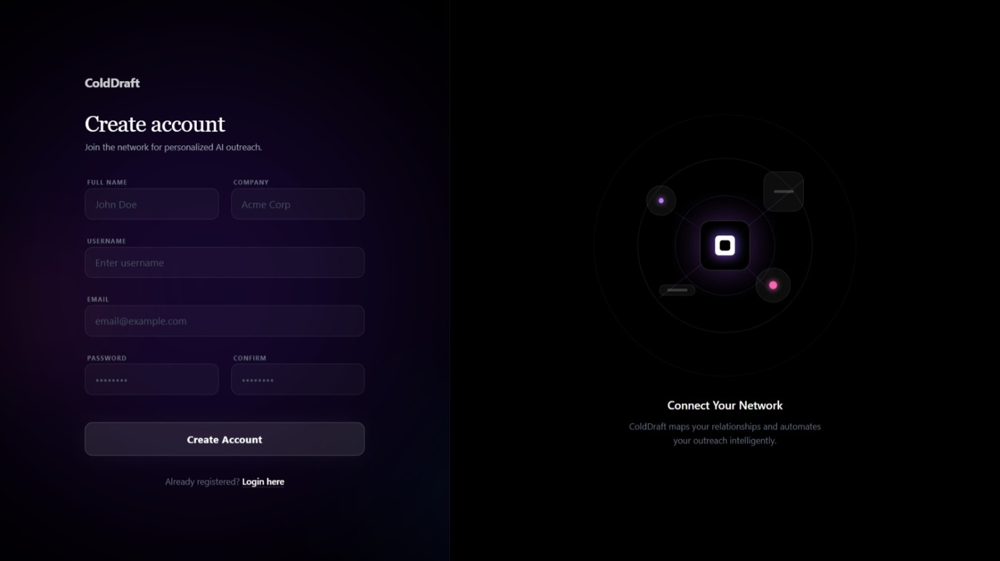
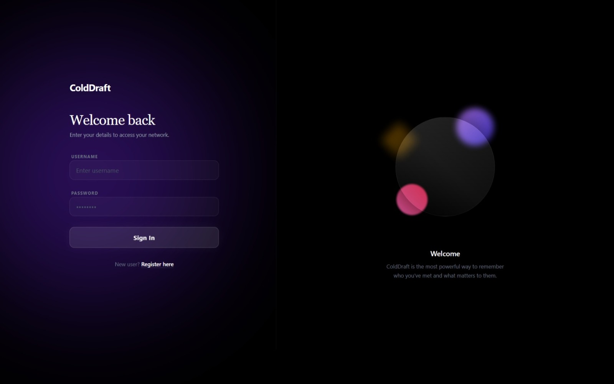
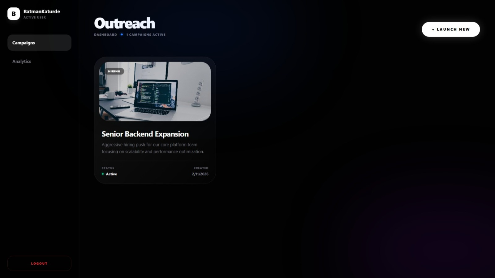
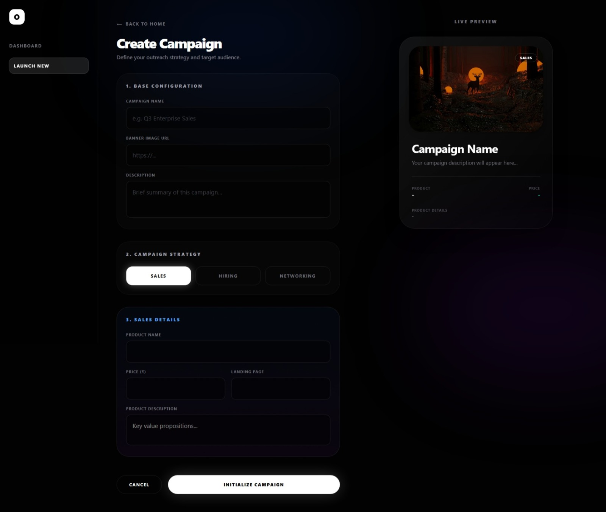
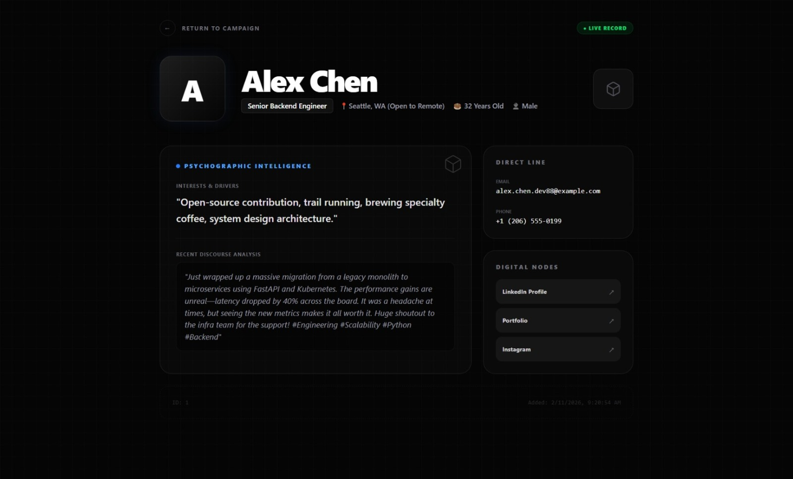
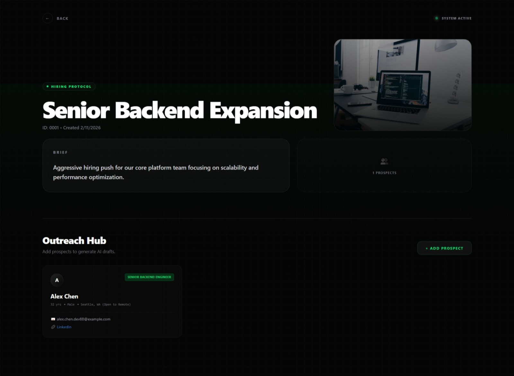
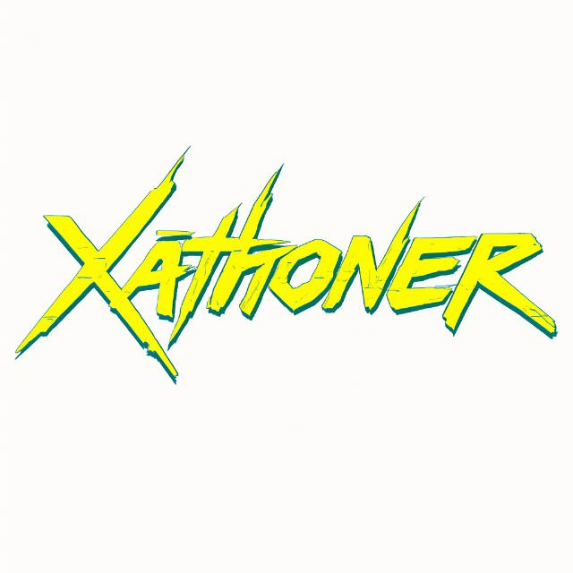

# System Architecture
### The architecture of the engine is informed by a modular "Ingest-Analyze-Generate" flow orchestrated by LangChain to facilitate seamless communication between the local model and the vector database:
## Overview of Technology 
| Stack Component | Technology | Purpose |
| :--- | :--- | :--- |
| **Frontend** | React JS | An interactive dashboard to facilitate inputting leads, visualizing profiles, and comparing messages. |
| **Backend** | FastAPI | A high-performance asynchronous API to facilitate orchestration of models and data processing. |
| **Authentication** | JWT | To ensure private sessions with leads and guarantee security of user data. |
| **Local LLM** | Llama 3 (8B) | The "brain" of the application, used to perform tone analysis and generation of multichannel content using Ollama or LocalAI. |
| **Vector DB** | Chroma DB | Stores past successful outreaches to leads and profile information of leads using RAG. |
| **Orchestration** | LangChain | Used to orchestrate the application by managing the RAG pipeline. |

 

#  Core Functional Workflow
## 1. Data Ingestion & Profile Synthesis
* The system accepts a LinkedIn URL or text and parses the data using LangChain document loaders.

* Tone Analysis: The LLM examines the "About" section and the posts to identify whether the user is "Corporate/Formal," "Tech-Casual," or "Hinglish/Regional."

## 2. The RAG Pipeline 

* To achieve quality improvement over time, the following technique is used: Retrieval-Augmented Generation (RAG):

* Knowledge Retrieval: The system accesses ChromaDB to retrieve similar kinds of leads or successful outreach templates previously sent in a particular industry before creating the message.

* Context Injection: This 'context' is injected into the Llama 3 prompt, allowing the fresh message not only to be specific to the individual but also to be consistent with what works for their peer group.

## 3. Multi-Channel

* The LLM processes the synthesized persona and RAG context and produces a JSON object containing:

* Email: Professional, well-structured with a clear subject heading.

* LinkedIn DM: Short, Related to Networking, References a Post

* WhatsApp/SMS: Concise, informal, and highly 

* Tone Consistency: Guarantees that emojis are included when writing a casual profile or omitted if writing a formal bank executive profile.

 

# Advantages of Offline and Security
* Data Sovereignty – Because Llama 3 runs locally using Ollama, your sensitive prospect data will always be stored on your machine and never reach the internet. This is a HUGE advantage for Legal and Compliance teams.

* Zero Latency/Cost – There are no longer any issues with usage limits from OpenAI/Anthropic or per token pricing.

* JWT Security - Provides protection of your local dashboard even though the frontend will be installed the server will still be accessible via a local network.

 

# Futuristic Scalability (Stretch Goals)

* Introduce a lead score using LLM’s to determine a “Reply Likelihood” score from 0 - 100 based off the strength of their personalization.

* Upload a CSV file with 100 LinkedIn URL's (batch processing) and create an entire outreach campaign with a single button click.

* Establish a "Mark As Successful" button, so that once we receive a response to the outbound campaign (the person replies), that the sent message will be saved into ChromaDB to assist in refining future RAG results based off previous successes.

 

# Have some glimpses about UI / UX.

## Registration Page

## Login Page

## Home Page

## Campaign Page

## Client Info Page

## Hub Page

 

# Project build by XATHONER

## All Members from Xathoner Team:

### Sahil Dinkar Katurde
Social Links: 
* Github: https://github.com/SahilKaturde
* LinkedIn: https://www.linkedin.com/in/sahil-katurde-b26690345/
* Email: sahilkaturde1@gmail.com
* Portfolio: https://sahilkaturde.netlify.app/

### Omkar Amit Pardeshi 
Social Links: 
* Github: https://github.com/Omkar96-18
* Email: omkarp.0906@gmail.com
### Atharva Amol Kulkarni
Social Links: 
* Github: https://github.com/Atharva-kul
* LinkedIn: https://www.linkedin.com/in/atharva-kulkarni-a1843829b/
* Email: 
### Khetaram Suthar
Social Links: 
* Github: https://github.com/Ksuthar99
* LinkedIn: https://www.linkedin.com/in/k-s-a36105338/
* Email: ss1940454@gmail.com

